<h1 align="center">Roman Sztergbaum</h1>

  <strong>Engineering Director | Low-Latency Systems | Blockchain Infrastructure</strong>

  <a href="https://sztergbaum.dev">Website</a> ·
  <a href="https://x.com/mileriesime">X / Twitter</a> ·
  <a href="https://linkedin.com/in/roman-sztergbaum">LinkedIn</a>

---

Technology executive with 8+ years building security-critical platforms, wallet infrastructure, and distributed cryptographic systems used by millions. From Nokia 5G R&D to Trust Wallet (Binance) to semiconductor engineering at CrossBar.

Currently building **[Mantis](https://github.com/Milerius/Mantis)** — a `no_std`-first Rust library for low-latency financial systems (HFT, order books, market microstructure), with first-class verification and performance tooling.

### What I work with

`Rust` · `C++` · `Go` · `Kotlin/KMP` · `Flutter/Dart` · `Systems Programming` · `Blockchain` · `Low-Latency` · `Lock-Free Data Structures`

### Career highlights

- **Director of Engineering** at CrossBar Inc. — semiconductor manufacturing
- **Staff Engineering Manager** at Trust Wallet (Binance) — wallet infrastructure serving millions
- **Software Developer / Project Manager** at Komodo — blockchain architecture, DeFi
- **5G R&D Engineer** at Nokia — radio base station software
- **EPITECH Paris** — Master's in Computer Science

---

### Featured projects

  <a href="https://github.com/Milerius/Mantis">
    <picture>
      <source srcset="profile/pin-mantis-dark.svg" media="(prefers-color-scheme: dark)" />
      <source srcset="profile/pin-mantis-light.svg" media="(prefers-color-scheme: light), (prefers-color-scheme: no-preference)" />
      
    </picture>
  </a>
  <a href="https://github.com/Milerius/mm2-client">
    <picture>
      <source srcset="profile/pin-mm2-dark.svg" media="(prefers-color-scheme: dark)" />
      <source srcset="profile/pin-mm2-light.svg" media="(prefers-color-scheme: light), (prefers-color-scheme: no-preference)" />
      
    </picture>
  </a>

---

  <picture>
    <source srcset="profile/stats-dark.svg" media="(prefers-color-scheme: dark)" />
    <source srcset="profile/stats-light.svg" media="(prefers-color-scheme: light), (prefers-color-scheme: no-preference)" />
    
  </picture>
  <picture>
    <source srcset="profile/langs-dark.svg" media="(prefers-color-scheme: dark)" />
    <source srcset="profile/langs-light.svg" media="(prefers-color-scheme: light), (prefers-color-scheme: no-preference)" />
    
  </picture>

